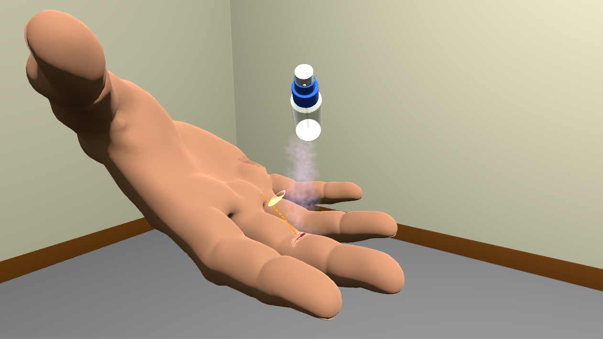

# Immunis
Immunis is tower defense game made for VR. The game focuses on the microscopic scale of Immunology. Development took two weeks (for a challenge).  
Most graphical elements were made by Edouard Angebault, Violaine Fayolle, Cléa Hemmendinger and Tiffany Luong.

## The game
- Hum, what happened here ?

- Looks like you were lucky ! The chainsaw didn't do much damage.

- Spray some antiseptics on the wound.

- Let's take a closer look.

- Infection is on the way, prepare some defenses.

- Bacterias are here ! (Bad ones)

## Code
You will find in this project:
* A basic unit AI, inspired by RTS like Warcraft and Starcraft:
	* Characteristics such as Health points, Attack, Speed, and so on...
	* Move-attack area, Move-attack, Attack unit, Move to attack unit, commands
	* Commands stack (move-attack then wait 5 seconds then move-attack,)
	* Basic virtual events system (OnDealDamage, OnTakeDamage, OnDie,)
	* Thought for inheritance with a lot of virtual functions (such as commands and events)
* A basic unit building system:
	* Active units (towers) are separated from their place*holding version (to ensure that AI is disabled during the building phase for example).
* Some UIs scripts for the player:
	* Display the current player's resources
	* Display the current player's selected tower
	* Display information about the next wave
* Simple tree for technologies
* Managers for the game:
	* Building manager (CellPlaceholderManager)
	* Game manager (GameManager.cs)
	* Towers manager (CellsManager.cs)
	* Inputs manager (InputsManager.cs, for Vive Controllers)
	* Enemies manager (BacteriasManager.cs)
	* All managers should have a GameObject with their script on it, to ensure that singletons are initialized at Awake.

All code is written in C# (Mono), with the highest encapsulation level possible (all fields and most functions are either private or protected for example).  
Awake() is preferred over Start() whenever possible.

Naming conventions used:
* Non-static class fields start with "m_" (for "member").
* Static class fields start with "s_" (for "static").
* Functions that are not getters/setters start with a capital letter.
* Function that are getters/setters and variables start with a lowercase letter.
* Variable and Function names are descriptive of what they do.

You will also find shaders used for this project.

